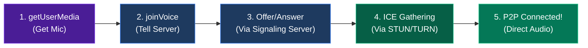
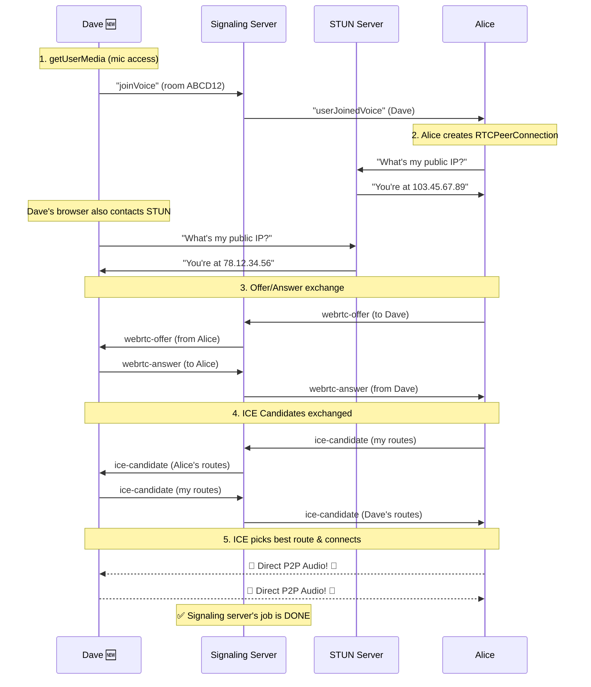

# Complete WebRTC Mesh Architecture — TalkRooms200 🎙️

## End-to-End Pipeline (The Big Picture)

When Dave clicks "Join Voice", **5 different systems** work together. Here's the full pipeline:

```
┌─────────────────────────────────────────────────────────────────────────────┐
│                    END-TO-END WebRTC PIPELINE                              │
│                                                                           │
│  ┌──────────┐    ┌──────────────────┐    ┌────────────┐    ┌───────────┐  │
│  │ Browser  │───▶│ Signaling Server │───▶│ STUN/TURN  │───▶│  Direct   │  │
│  │  (getUserMedia) │  (Socket.IO)     │    │  Servers   │    │  P2P Audio│  │
│  └──────────┘    └──────────────────┘    └────────────┘    └───────────┘  │
│   Step 1: Mic     Step 2-7: Exchange      Step 8: Find      Step 9:      │
│   Access          Offer/Answer/ICE        Network Route     Audio Flows! │
└─────────────────────────────────────────────────────────────────────────────┘
```



---

## The 3 Servers Involved (and Their Jobs)

| Server | What It Does | Analogy | Used In TalkRooms200? |
|--------|-------------|---------|----------------------|
| **Signaling Server** | Passes Offer/Answer/ICE messages between browsers | 📬 Postman | ✅ Yes — your Socket.IO backend |
| **STUN Server** | Tells a browser its **public IP address** | 🪞 Mirror ("this is how the world sees you") | ✅ Yes — Google's free STUN servers |
| **TURN Server** | Relays actual audio when direct connection fails | 📡 Relay antenna | ❌ Not yet (explained below) |

---

## STUN Server — "What's My Public Address?" 🪞

### The Problem
Your browser knows its **local/private IP** (like `192.168.1.5`), but the other person can't reach you at that address — they're on a different network. You need your **public IP** (like `103.45.67.89`).

### How STUN Works
Your browser sends a tiny request to a STUN server saying "Hey, what IP and port do you see me at?" The STUN server replies with your public-facing address. That's it — super simple!

```
Dave's Browser                    STUN Server (stun.l.google.com)
     │                                    │
     │── "What's my public IP?" ─────────▶│
     │                                    │
     │◀── "You're at 103.45.67.89:5234" ──│
     │                                    │
     ✅ Now Dave can share this address
        with Alice via the signaling server
```

### Your Code That Uses STUN

```javascript
// Frontend — ChatRoom.jsx
const STUN_SERVERS = {
  iceServers: [
    { urls: 'stun:stun.l.google.com:19302' },   // Google's free STUN
    { urls: 'stun:stun1.l.google.com:19302' },  // Backup STUN
  ]
};

// Every peer connection uses these STUN servers
const pc = new RTCPeerConnection(STUN_SERVERS);
```

When you create an `RTCPeerConnection`, the browser automatically contacts these STUN servers in the background to discover its public IP. This info becomes part of the **ICE candidates** that get sent to the other person.

### STUN Is Free & Fast
- Google provides free STUN servers (that's what you're using)
- STUN only handles a single tiny request — no ongoing traffic
- Works for ~85% of users

---

## TURN Server — "The Backup Plan" 📡

### When STUN Isn't Enough
Sometimes two browsers **cannot connect directly** even with their public IPs. This happens when:

```
┌─────────────────────────────────────────────────────────┐
│  When direct P2P FAILS:                                 │
│                                                         │
│  ❌ Strict corporate firewalls blocking P2P traffic     │
│  ❌ Symmetric NAT (some mobile carriers, strict routers)│
│  ❌ VPN users                                           │
│  ❌ Some university/hotel WiFi networks                 │
│                                                         │
│  This affects ~10-15% of connections!                   │
└─────────────────────────────────────────────────────────┘
```

### How TURN Works
Instead of giving up, the audio gets **relayed through the TURN server**. It's not peer-to-peer anymore, but at least it works!

```
WITHOUT TURN (fails for some users):

  Dave ──── ✖ BLOCKED ✖ ────── Alice
             (firewall)

WITH TURN (always works):

  Dave ──audio──▶ TURN Server ──audio──▶ Alice
  Dave ◀──audio── TURN Server ◀──audio── Alice
```

### How To Add TURN To TalkRooms200

You'd update the STUN config to also include a TURN server:

```javascript
// Frontend — ChatRoom.jsx (what it would look like)
const ICE_SERVERS = {
  iceServers: [
    // STUN (free, used first)
    { urls: 'stun:stun.l.google.com:19302' },
    
    // TURN (paid, used as fallback when STUN fails)  
    {
      urls: 'turn:your-turn-server.com:3478',
      username: 'your-username',
      credential: 'your-password'
    }
  ]
};
```

> [!NOTE]
> **TalkRooms200 does NOT use TURN yet.** This means ~10-15% of users behind strict firewalls might fail to connect. Adding a TURN server would fix this. Free/cheap options: [Metered TURN](https://www.metered.ca/turn-server) (500GB free), [Twilio](https://www.twilio.com/stun-turn) (free trial), or self-host with [coturn](https://github.com/coturn/coturn).

### STUN vs TURN Summary

```
  ICE Candidate gathering tries connections in this order:

  1️⃣  Host Candidate (local network — same WiFi)     ← fastest
  2️⃣  Server Reflexive (via STUN — public IP)         ← most common  
  3️⃣  Relay Candidate (via TURN — relayed)             ← last resort

  WebRTC tries ALL of them and picks the BEST one that works!
  This process is called "ICE" (Interactive Connectivity Establishment)
```

---

## The Problem: Browsers Can't Talk Directly (At First)

Imagine you want to make a phone call. You need to **dial a number first** — you can't just start talking into thin air. Similarly, in WebRTC, two browsers need a way to **exchange connection details** before they can send audio directly to each other.

**That's what the signaling server does** — it's the "phone operator" that passes connection details between browsers. It does NOT carry the actual audio — it just helps browsers find each other.

---

## The 3 Things That Get Exchanged

| Thing | What It Is (Simple) | Analogy |
|-------|---------------------|---------| 
| **Offer** | "Hey, I want to talk to you. Here's my connection info." | Like dialing someone's number |
| **Answer** | "Cool, I accept! Here's my connection info too." | Like picking up the phone |
| **ICE Candidate** | "By the way, here are the different routes to reach me." | Like giving alternative phone numbers |

---

## Scenario: 3 People in Voice, 4th Person Joins

### Starting State
```
Room "ABCD12" — Voice Chat Active:
  👤 Alice  (socketId: "aaa") — in voice ✅
  👤 Bob    (socketId: "bbb") — in voice ✅  
  👤 Charlie(socketId: "ccc") — in voice ✅
  👤 Dave   (socketId: "ddd") — in room but NOT in voice ❌
```

Alice, Bob, and Charlie are already connected to each other with peer-to-peer audio. They already went through the offer/answer dance earlier.

### Now Dave Clicks "Join Voice" 🎤

Here's **exactly** what happens step by step:

---

### Step 1: Dave Gets Mic Access & Tells Server

```javascript
// Frontend — Dave's browser (ChatRoom.jsx)
const handleJoinVoice = async () => {
  // 1. Ask browser for microphone
  const stream = await navigator.mediaDevices.getUserMedia({ audio: true });
  localStreamRef.current = stream;

  // 2. Tell signaling server: "I want to join voice!"
  socket.emit("joinVoice", { room: "ABCD12" });
};
```

### Step 2: Server Checks & Broadcasts

```javascript
// Backend — Signaling Server (sockets/index.js)
socket.on("joinVoice", ({ room }) => {
  const userData = userSocketMap.get(socket.id); // Dave's data
  
  // Check if room is full (max 6)
  let voiceCount = 0;
  userSocketMap.forEach((val) => {
    if (val.roomCode === room && val.inVoice) voiceCount++;
  });

  if (voiceCount >= 6) {
    socket.emit("voiceError", { message: "Voice channel is full!" });
    return;
  }

  // ✅ Mark Dave as "in voice"
  userData.inVoice = true;
  userSocketMap.set(socket.id, userData);

  // 📢 Tell Alice, Bob, Charlie: "Dave joined voice!"
  socket.to(room).emit("userJoinedVoice", {
    socketId: socket.id,        // "ddd"
    userId: userData.userId,
    username: "Dave"
  });
});
```

> [!IMPORTANT]
> The server **does NOT create any WebRTC connections**. It just says: _"Hey everyone, Dave is here."_ The browsers do the rest themselves!

### Step 3: Alice, Bob, Charlie Each Send Dave an Offer

When Alice's browser receives `"userJoinedVoice"`, she **creates a peer connection and sends an offer to Dave**:

```javascript
// Frontend — Alice's browser hears "userJoinedVoice"
const handleUserJoinedVoice = async ({ socketId, username }) => {
  // socketId = "ddd" (Dave's socket)
  
  // 1. Create a new WebRTC connection for Dave
  const pc = createPeerConnection(socketId);  // "ddd"
  
  // 2. Create an OFFER (connection proposal)
  const offer = await pc.createOffer();
  await pc.setLocalDescription(offer);

  // 3. Send the offer to Dave VIA THE SIGNALING SERVER
  socket.emit("webrtc-offer", { offer, to: "ddd" });
};
```

**Bob and Charlie do the EXACT same thing** — they each independently create their own peer connection to Dave and send their own offers.

```
  Alice ──offer──→ Server ──offer──→ Dave  (from: "aaa")
  Bob   ──offer──→ Server ──offer──→ Dave  (from: "bbb")
  Charlie──offer──→ Server ──offer──→ Dave  (from: "ccc")
```

### Step 4: Server Relays the Offers (Just a Postman 📬)

The server **does nothing smart here** — it just forwards the message to the right person:

```javascript
// Backend — Signaling Server (sockets/index.js)

// Relay SDP Offer — just pass it along!
socket.on("webrtc-offer", ({ offer, to }) => {
  socket.to(to).emit("webrtc-offer", {
    offer,
    from: socket.id  // So Dave knows WHO sent this offer
  });
});
```

### Step 5: Dave Receives 3 Offers and Sends 3 Answers

Dave's browser receives offers from Alice, Bob, and Charlie. For EACH one, he creates an answer:

```javascript
// Frontend — Dave's browser hears "webrtc-offer" (3 times!)
const handleWebRTCOffer = async ({ offer, from }) => {
  // from = "aaa" (Alice), then "bbb" (Bob), then "ccc" (Charlie)

  // 1. Create a peer connection for this person
  const pc = createPeerConnection(from);
  
  // 2. Set their offer as the remote description
  await pc.setRemoteDescription(new RTCSessionDescription(offer));

  // 3. Create an ANSWER
  const answer = await pc.createAnswer();
  await pc.setLocalDescription(answer);

  // 4. Send answer back VIA THE SIGNALING SERVER
  socket.emit("webrtc-answer", { answer, to: from });
};
```

```
  Dave ──answer──→ Server ──answer──→ Alice   (to: "aaa")
  Dave ──answer──→ Server ──answer──→ Bob     (to: "bbb")
  Dave ──answer──→ Server ──answer──→ Charlie (to: "ccc")
```

### Step 6: Server Relays the Answers

```javascript
// Backend — Signaling Server
socket.on("webrtc-answer", ({ answer, to }) => {
  socket.to(to).emit("webrtc-answer", {
    answer,
    from: socket.id  // So Alice knows this answer is from Dave
  });
});
```

### Step 7: Alice, Bob, Charlie Accept the Answer

```javascript
// Frontend — Alice's browser hears "webrtc-answer"
const handleWebRTCAnswer = async ({ answer, from }) => {
  // from = "ddd" (Dave)
  const pc = peerConnectionsRef.current[from];
  if (pc) {
    await pc.setRemoteDescription(new RTCSessionDescription(answer));
  }
  // ✅ Connection handshake complete! 
};
```

### Step 8: ICE Candidates — STUN & TURN in Action! 🧊

This is where STUN and TURN come in. Throughout the offer/answer process, **both sides simultaneously gather ICE candidates** — these are network routes discovered by contacting STUN/TURN servers:

```
What happens INSIDE the browser during createPeerConnection():

  RTCPeerConnection created with STUN/TURN config
       │
       ├──▶ Contacts STUN server → gets public IP → "Server Reflexive" candidate
       │     (stun:stun.l.google.com:19302)
       │
       ├──▶ Checks local network → "Host" candidate (e.g. 192.168.1.5)
       │
       └──▶ Contacts TURN server (if configured) → "Relay" candidate
             (turn:your-turn-server.com)
       
  Each candidate is fired via pc.onicecandidate and sent to other peer
```

```javascript
// Frontend — Created during createPeerConnection()
pc.onicecandidate = (event) => {
  if (event.candidate) {
    // Send each discovered route to the other person via signaling server
    socket.emit("webrtc-ice-candidate", {
      candidate: event.candidate,
      to: targetSocketId
    });
  }
};

// The other person adds the candidate to try that route
const handleWebRTCICECandidate = async ({ candidate, from }) => {
  const pc = peerConnectionsRef.current[from];
  if (pc) {
    await pc.addIceCandidate(new RTCIceCandidate(candidate));
  }
};
```

```javascript
// Backend — Server just relays, as always
socket.on("webrtc-ice-candidate", ({ candidate, to }) => {
  socket.to(to).emit("webrtc-ice-candidate", {
    candidate,
    from: socket.id
  });
});
```

WebRTC then **tests ALL candidates** and picks the best working route:

```
  Priority order:
  
  1️⃣  Host ─────── (local network, same WiFi)        🟢 Fastest, 0ms latency
  2️⃣  STUN result ─ (direct P2P over internet)        🟡 Good, ~20-50ms  
  3️⃣  TURN relay ── (routed through TURN server)       🟠 Slower, ~50-150ms
  
  If 1 works → use it. If not, try 2. If not, try 3. If nothing → ❌ fail.
```

### Step 9: 🎉 Audio Flows Directly (No More Server!)

Once the best ICE candidate pair is selected, **audio flows directly between browsers** — the signaling server is no longer involved!

---

## Full End-to-End Pipeline — Everything Together



---

## Visual Summary — Mesh Topology

```
BEFORE Dave joins:

  Alice ←──audio──→ Bob
  Alice ←──audio──→ Charlie
  Bob   ←──audio──→ Charlie

  (3 direct connections)
  
AFTER Dave joins:

  Alice   ←──audio──→ Bob
  Alice   ←──audio──→ Charlie
  Alice   ←──audio──→ Dave       ← NEW
  Bob     ←──audio──→ Charlie
  Bob     ←──audio──→ Dave       ← NEW
  Charlie ←──audio──→ Dave       ← NEW

  (6 direct connections — this is called "Full Mesh")
```

### Why Mesh Has a User Limit

```
Users    Connections     Formula: n(n-1)/2
  2          1
  3          3
  4          6
  5         10
  6         15           ← TalkRooms200 max (each user has 5 connections!)
  10        45           ← Would kill most browsers
  50      1225           ← Impossible without SFU
```

---

## Key Takeaways

| Concept | Explanation |
|---------|-------------|
| **Signaling Server = Postman** | Passes Offer/Answer/ICE messages. Never touches audio. |
| **STUN Server = Mirror** | Tells browser its public IP. Free, fast, one-shot. |
| **TURN Server = Relay** | Forwards audio when direct P2P fails (~15% of users). Costs money. |
| **ICE = Route Finder** | Gathers all possible routes (local, STUN, TURN) and picks the best one. |
| **Offer = "Let's connect"** | Created by person ALREADY in voice. Contains codec & connection info. |
| **Answer = "Sure, here's my info"** | Created by the NEW person. Completes the handshake. |
| **Full Mesh** | Everyone connects to everyone. Simple but max ~6 users. |
| **After handshake** | Audio goes browser-to-browser. Server is done. |

> [!WARNING]
> **TalkRooms200 currently has no TURN server.** This means users behind strict firewalls/VPNs may fail to connect. Consider adding one (e.g., [Metered TURN](https://www.metered.ca/turn-server) — 500GB free) for production reliability.
